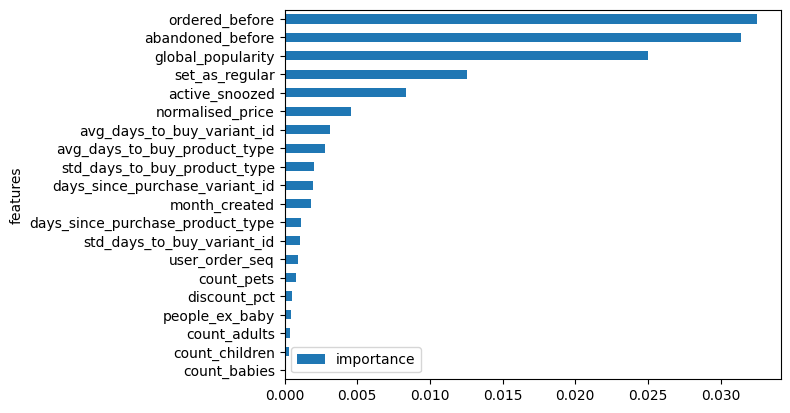
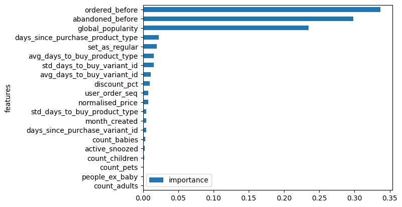
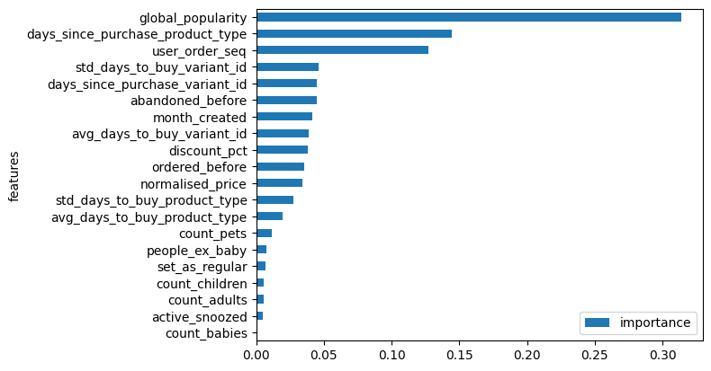
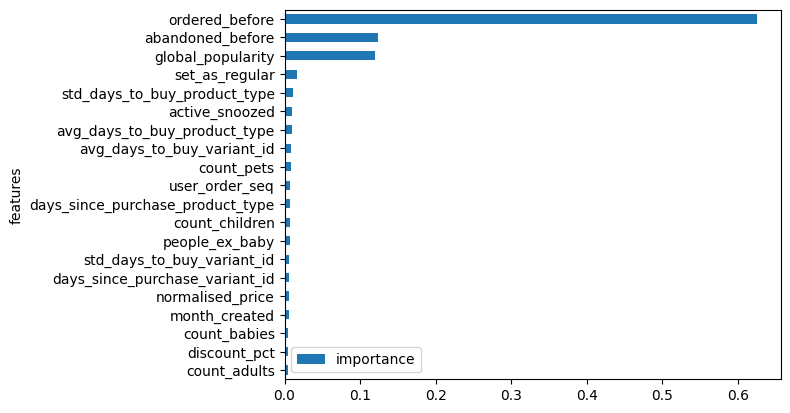
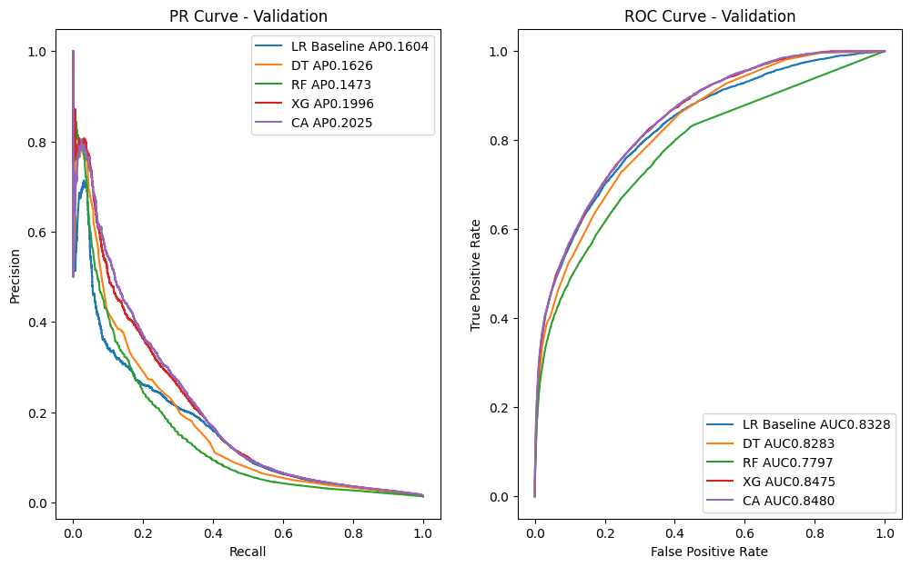
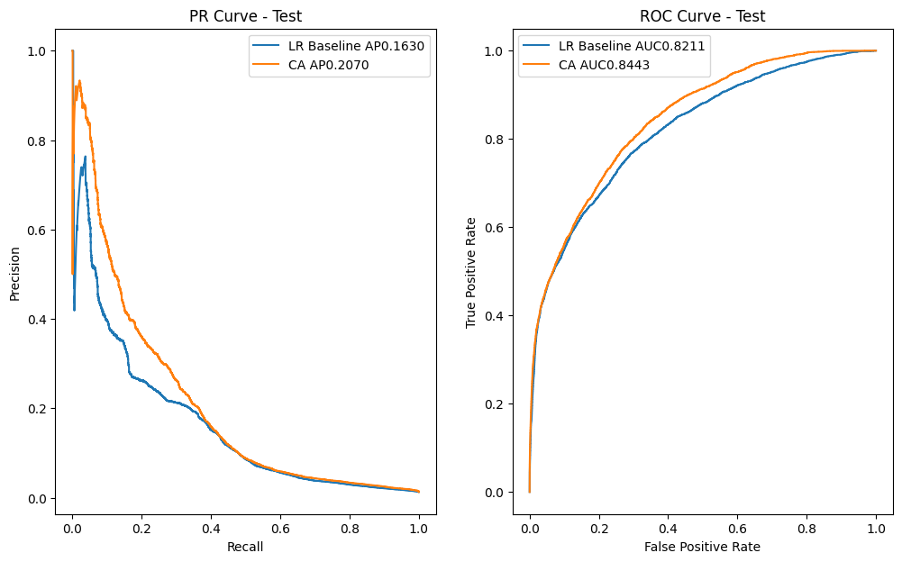

# Module 4 - Non linear modeling

# Outcome

The metric used to choose one model over another was the average_precision_score (AP), given that this is an imbalanced problem. Starting with the Ridge linear model as a baseline with the best AP, comparisons were made with nonlinear models such as decision trees, random forests, XGBoost, and CatBoost. For each of these models, the process included:

- Hyperparameter tuning with all features included.
- Selection of the best configuration based on AP.
- Feature importance analysis for the selected configuration.
- Hyperparameter tuning using only the previously identified important features.
- Final selection of the best configuration.

After selecting the best configuration for each type of nonlinear model, precision-recall curves were plotted for all of them, and the best-performing model was chosen. This final model was then applied to the test subset, and its confusion matrix was calculated for a specific threshold.


```python
import pandas as pd
import numpy as np
import matplotlib.pyplot as plt
from sklearn.pipeline import make_pipeline
from sklearn.pipeline import Pipeline
from sklearn.preprocessing import StandardScaler
from sklearn.linear_model import LogisticRegression
from sklearn.tree import DecisionTreeClassifier
from sklearn.ensemble import RandomForestClassifier
from xgboost import XGBClassifier
from sklearn.metrics import (
    precision_recall_curve,
    auc,
    roc_curve,
    roc_auc_score,
    average_precision_score,
)
from sklearn.metrics import confusion_matrix
import random
from catboost import CatBoostClassifier, Pool
```


```python
data = pd.read_csv(r"/home/raquel/zrive-ds/src/module_3/feature_frame.csv")
```


```python
# Orders with more than 5 products
purchases = data[data["outcome"] == 1]
purchases = purchases.groupby("order_id").size().reset_index(name="n_products")
purch_5_prod = purchases[purchases["n_products"] >= 5]
```

The previous DataFrame contains the products purchased in each of the orders with more than 5 products. I complete the dataset with those products that have NOT been purchased in these baskets


```python
purch_5_prod = data[data["order_id"].isin(purch_5_prod["order_id"])]
print(purch_5_prod.shape)
```

    (2163953, 27)


```python
# For a recommendation algorithm, I think it could be useful to create a feature that extracts the month of the purchase.
purch_5_prod = purch_5_prod.assign(
    created_at=lambda x: pd.to_datetime(x.created_at),
    month_created=lambda x: x.created_at.dt.month,
    order_date=lambda x: pd.to_datetime(x.order_date),
)
purch_5_prod.head(2)
```


<div>
<style scoped>
    .dataframe tbody tr th:only-of-type {
        vertical-align: middle;
    }

    .dataframe tbody tr th {
        vertical-align: top;
    }

    .dataframe thead th {
        text-align: right;
    }
</style>
<table border="1" class="dataframe">
  <thead>
    <tr style="text-align: right;">
      <th></th>
      <th>variant_id</th>
      <th>product_type</th>
      <th>order_id</th>
      <th>user_id</th>
      <th>created_at</th>
      <th>order_date</th>
      <th>user_order_seq</th>
      <th>outcome</th>
      <th>ordered_before</th>
      <th>abandoned_before</th>
      <th>...</th>
      <th>count_babies</th>
      <th>count_pets</th>
      <th>people_ex_baby</th>
      <th>days_since_purchase_variant_id</th>
      <th>avg_days_to_buy_variant_id</th>
      <th>std_days_to_buy_variant_id</th>
      <th>days_since_purchase_product_type</th>
      <th>avg_days_to_buy_product_type</th>
      <th>std_days_to_buy_product_type</th>
      <th>month_created</th>
    </tr>
  </thead>
  <tbody>
    <tr>
      <th>0</th>
      <td>33826472919172</td>
      <td>ricepastapulses</td>
      <td>2807985930372</td>
      <td>3482464092292</td>
      <td>2020-10-05 16:46:19</td>
      <td>2020-10-05</td>
      <td>3</td>
      <td>0.0</td>
      <td>0.0</td>
      <td>0.0</td>
      <td>...</td>
      <td>0.0</td>
      <td>0.0</td>
      <td>2.0</td>
      <td>33.0</td>
      <td>42.0</td>
      <td>31.134053</td>
      <td>30.0</td>
      <td>30.0</td>
      <td>24.27618</td>
      <td>10</td>
    </tr>
    <tr>
      <th>1</th>
      <td>33826472919172</td>
      <td>ricepastapulses</td>
      <td>2808027644036</td>
      <td>3466586718340</td>
      <td>2020-10-05 17:59:51</td>
      <td>2020-10-05</td>
      <td>2</td>
      <td>0.0</td>
      <td>0.0</td>
      <td>0.0</td>
      <td>...</td>
      <td>0.0</td>
      <td>0.0</td>
      <td>2.0</td>
      <td>33.0</td>
      <td>42.0</td>
      <td>31.134053</td>
      <td>30.0</td>
      <td>30.0</td>
      <td>24.27618</td>
      <td>10</td>
    </tr>
  </tbody>
</table>
<p>2 rows × 28 columns</p>
</div>


# Train-Val-Test split

Im'm going to do a common train-val-test split for all the models. 
- The train subset for ensemble learning will be divided as corresponds in each model.
- The validation subset will be the tool to identify overfitting.
- The test subset will be the final proof.


```python
# To avoid information leakage, I will follow the chronological order and all products from the same order within the same subset
daily_orders = purch_5_prod.groupby("order_date").order_id.nunique()
cumsum_daily_orders = daily_orders.cumsum() / daily_orders.sum()

train_val_cutoff = cumsum_daily_orders[cumsum_daily_orders <= 0.7].idxmax()
val_test_cutoff = cumsum_daily_orders[cumsum_daily_orders <= 0.9].idxmax()

print("Train since", cumsum_daily_orders.index.min())
print("Train until", train_val_cutoff)
print("Val until", val_test_cutoff)
print("Test until", cumsum_daily_orders.index.max())
```

    Train since 2020-10-05 00:00:00
    Train until 2021-02-04 00:00:00
    Val until 2021-02-22 00:00:00
    Test until 2021-03-03 00:00:00


```python
train_df = purch_5_prod[purch_5_prod.order_date <= train_val_cutoff]
val_df = purch_5_prod[
    (purch_5_prod.order_date > train_val_cutoff)
    & (purch_5_prod.order_date <= val_test_cutoff)
]
test_df = purch_5_prod[purch_5_prod.order_date > val_test_cutoff]
```


```python
# Without predictive power
info_cols = ["variant_id", "order_id", "user_id", "created_at", "order_date"]
label_col = "outcome"
feature_cols = [
    col for col in purch_5_prod.columns if col not in info_cols + [label_col]
]
# Breaking down the features
categorical_cols = ["product_type", "vendor"]
binary_cols = ["ordered_before", "abandoned_before", "active_snoozed", "set_as_regular"]
numerical_cols = [
    col for col in feature_cols if col not in categorical_cols + binary_cols
]
train_cols = numerical_cols + binary_cols
```


```python
X_train = train_df.drop(label_col, axis=1)
y_train = train_df[label_col]
X_val = val_df.drop(label_col, axis=1)
y_val = val_df["outcome"]
X_test = test_df.drop(label_col, axis=1)
y_test = test_df["outcome"]
```


```python
def evaluate_model(
    clf,
    X_train,
    y_train,
    X_val,
    y_val,
    train_aucs_list,
    val_aucs_list,
    train_aps_list,
    val_aps_list,
):
    train_preds = clf.predict_proba(X_train)[:, 1]
    val_preds = clf.predict_proba(X_val)[:, 1]
    train_auc = roc_auc_score(y_train, train_preds)
    val_auc = roc_auc_score(y_val, val_preds)
    train_ap = average_precision_score(y_train, train_preds)
    val_ap = average_precision_score(y_val, val_preds)

    train_aucs_list.append(train_auc)
    val_aucs_list.append(val_auc)
    train_aps_list.append(train_ap)
    val_aps_list.append(val_ap)


def plot_feature_importance(clf, columns):
    fig, ax = plt.subplots()
    fi = pd.DataFrame(
        list(zip(columns, clf.feature_importances_)), columns=["features", "importance"]
    ).sort_values(by="importance", ascending=True)
    fi.plot(kind="barh", x="features", y="importance", ax=ax)
    return fi, fig, ax
```

First, I'm going to avoid categorical variables


```python
train_cols = numerical_cols + binary_cols
```

# Linear Baseline

Ridge


```python
lr_ridge_train_aucs_list = []
lr_ridge_val_aucs_list = []
lr_ridge_train_aps_list = []
lr_ridge_val_aps_list = []
cs = [1e-8, 1e-6, 1e-4, 1e-2, 1, 100, 1e4]
for c in cs:
    lr = make_pipeline(StandardScaler(), LogisticRegression(penalty="l2", C=c))
    lr.fit(X_train[train_cols], y_train)
    evaluate_model(
        lr,
        X_train[train_cols],
        y_train,
        X_val[train_cols],
        y_val,
        lr_ridge_train_aucs_list,
        lr_ridge_val_aucs_list,
        lr_ridge_train_aps_list,
        lr_ridge_val_aps_list,
    )

    print(
        f"LR Ridge c={c}: train_auc= {lr_ridge_train_aucs_list[-1]:.4f} and val_auc= {lr_ridge_val_aucs_list[-1]:.4f}."
        f" Train_ap= {lr_ridge_train_aps_list[-1]:.4f} and val_ap= {lr_ridge_val_aps_list[-1]:.4f}."
    )
```

    LR Ridge c=1e-08: train_auc= 0.8242 and val_auc= 0.8319. Train_ap= 0.1561 and val_ap= 0.1602.
    LR Ridge c=1e-06: train_auc= 0.8249 and val_auc= 0.8326. Train_ap= 0.1564 and val_ap= 0.1603.
    LR Ridge c=0.0001: train_auc= 0.8114 and val_auc= 0.8240. Train_ap= 0.1602 and val_ap= 0.1585.
    LR Ridge c=0.01: train_auc= 0.7983 and val_auc= 0.8130. Train_ap= 0.1585 and val_ap= 0.1557.
    LR Ridge c=1: train_auc= 0.7980 and val_auc= 0.8127. Train_ap= 0.1585 and val_ap= 0.1557.
    LR Ridge c=100: train_auc= 0.7980 and val_auc= 0.8127. Train_ap= 0.1585 and val_ap= 0.1557.
    LR Ridge c=10000.0: train_auc= 0.7980 and val_auc= 0.8127. Train_ap= 0.1585 and val_ap= 0.1557.


It appears that none of the regularization values lead to overfitting, although the best result is observed with c=1e-06.

Lasso


```python
lr_lasso_train_aucs_list = []
lr_lasso_val_aucs_list = []
lr_lasso_train_aps_list = []
lr_lasso_val_aps_list = []
cs = [1e-8, 1e-6, 1e-4, 1e-2, 1, 100, 1e4]
for c in cs:
    lr = make_pipeline(
        StandardScaler(), LogisticRegression(penalty="l1", C=c, solver="saga")
    )
    lr.fit(X_train[train_cols], y_train)
    evaluate_model(
        lr,
        X_train[train_cols],
        y_train,
        X_val[train_cols],
        y_val,
        lr_lasso_train_aucs_list,
        lr_lasso_val_aucs_list,
        lr_lasso_train_aps_list,
        lr_lasso_val_aps_list,
    )

    print(
        f"LR Lasso c={c}: train_auc= {lr_lasso_train_aucs_list[-1]:.4f} and val_auc= {lr_lasso_val_aucs_list[-1]:.4f}."
        f" Train_ap= {lr_lasso_train_aps_list[-1]:.4f} and val_ap= {lr_lasso_val_aps_list[-1]:.4f}."
    )
```

    LR Lasso c=1e-08: train_auc= 0.5000 and val_auc= 0.5000. Train_ap= 0.0151 and val_ap= 0.0135.
    LR Lasso c=1e-06: train_auc= 0.5000 and val_auc= 0.5000. Train_ap= 0.0151 and val_ap= 0.0135.
    LR Lasso c=0.0001: train_auc= 0.8330 and val_auc= 0.8344. Train_ap= 0.1615 and val_ap= 0.1484.
    LR Lasso c=0.01: train_auc= 0.7996 and val_auc= 0.8143. Train_ap= 0.1587 and val_ap= 0.1563.
    LR Lasso c=1: train_auc= 0.7979 and val_auc= 0.8126. Train_ap= 0.1585 and val_ap= 0.1558.
    LR Lasso c=100: train_auc= 0.7979 and val_auc= 0.8126. Train_ap= 0.1585 and val_ap= 0.1558.
    LR Lasso c=10000.0: train_auc= 0.7979 and val_auc= 0.8126. Train_ap= 0.1585 and val_ap= 0.1558.


Since the best val_ap was achieved with Ridge at c=1e-06, I will extract the feature importance, and this model will serve as the reference baseline.


```python
lr = Pipeline(
    [
        ("standard_scaler", StandardScaler()),
        ("lr", LogisticRegression(penalty="l2", C=1e-6)),
    ]
)
lr.fit(X_train[train_cols], y_train)
lr_coeff = pd.DataFrame(
    {"features": train_cols, "importance": np.abs(lr.named_steps["lr"].coef_[0])}
).sort_values(by="importance", ascending=True)
```


```python
lr_coeff.plot(kind="barh", x="features", y="importance")
```


    <Axes: ylabel='features'>


    

    


I’ll remove the last five features and retrain the Ridge model.


```python
lr_filtered_cols = lr_coeff["features"].iloc[-15:]
lr_filtered_cols
```


    7                           count_pets
    0                       user_order_seq
    11          std_days_to_buy_variant_id
    12    days_since_purchase_product_type
    15                       month_created
    9       days_since_purchase_variant_id
    14        std_days_to_buy_product_type
    13        avg_days_to_buy_product_type
    10          avg_days_to_buy_variant_id
    1                     normalised_price
    18                      active_snoozed
    19                      set_as_regular
    3                    global_popularity
    17                    abandoned_before
    16                      ordered_before
    Name: features, dtype: object


```python
lr_ridge_train_aucs_list = []
lr_ridge_val_aucs_list = []
lr_ridge_train_aps_list = []
lr_ridge_val_aps_list = []
cs = [1e-8, 1e-6, 1e-4, 1e-2, 1, 100, 1e4]
for c in cs:
    lr = make_pipeline(StandardScaler(), LogisticRegression(penalty="l2", C=c))
    lr.fit(X_train[lr_filtered_cols], y_train)
    evaluate_model(
        lr,
        X_train[lr_filtered_cols],
        y_train,
        X_val[lr_filtered_cols],
        y_val,
        lr_ridge_train_aucs_list,
        lr_ridge_val_aucs_list,
        lr_ridge_train_aps_list,
        lr_ridge_val_aps_list,
    )

    print(
        f"LR Ridge c={c}: train_auc= {lr_ridge_train_aucs_list[-1]:.4f} and val_auc= {lr_ridge_val_aucs_list[-1]:.4f}."
        f" Train_ap= {lr_ridge_train_aps_list[-1]:.4f} and val_ap= {lr_ridge_val_aps_list[-1]:.4f}."
    )
```

    LR Ridge c=1e-08: train_auc= 0.8249 and val_auc= 0.8323. Train_ap= 0.1563 and val_auc= 0.1603.
    LR Ridge c=1e-06: train_auc= 0.8254 and val_auc= 0.8328. Train_ap= 0.1565 and val_auc= 0.1604.
    LR Ridge c=0.0001: train_auc= 0.8118 and val_auc= 0.8244. Train_ap= 0.1602 and val_auc= 0.1585.
    LR Ridge c=0.01: train_auc= 0.7982 and val_auc= 0.8131. Train_ap= 0.1585 and val_auc= 0.1560.
    LR Ridge c=1: train_auc= 0.7980 and val_auc= 0.8129. Train_ap= 0.1585 and val_auc= 0.1559.
    LR Ridge c=100: train_auc= 0.7980 and val_auc= 0.8129. Train_ap= 0.1585 and val_auc= 0.1559.
    LR Ridge c=10000.0: train_auc= 0.7980 and val_auc= 0.8129. Train_ap= 0.1585 and val_auc= 0.1559.


The best result is still with c=1e-06, achieving a val_ap of 0.1604 (BASELINE)

# Decision trees


```python
dt_train_aucs_list = []
dt_val_aucs_list = []
dt_train_aps_list = []
dt_val_aps_list = []
mds = [4, 5, 6, 8, 10]
for md in mds:
    dt = DecisionTreeClassifier(max_depth=md)
    dt.fit(X_train[train_cols], y_train)
    evaluate_model(
        dt,
        X_train[train_cols],
        y_train,
        X_val[train_cols],
        y_val,
        dt_train_aucs_list,
        dt_val_aucs_list,
        dt_train_aps_list,
        dt_val_aps_list,
    )

    print(
        f"Decision Tree max_depth={md}: train_auc= {dt_train_aucs_list[-1]:.4f} and val_auc= {dt_val_aucs_list[-1]:.4f}."
        f" Train_ap= {dt_train_aps_list[-1]:.4f} and val_ap= {dt_val_aps_list[-1]:.4f}."
    )
```

    Decision Tree max_depth=4: train_auc= 0.8140 and val_auc= 0.8101. Train_ap= 0.1386 and val_ap= 0.1265.
    Decision Tree max_depth=5: train_auc= 0.8171 and val_auc= 0.8182. Train_ap= 0.1549 and val_ap= 0.1457.
    Decision Tree max_depth=6: train_auc= 0.8314 and val_auc= 0.8336. Train_ap= 0.1695 and val_ap= 0.1554.
    Decision Tree max_depth=8: train_auc= 0.8384 and val_auc= 0.8366. Train_ap= 0.1924 and val_ap= 0.1595.
    Decision Tree max_depth=10: train_auc= 0.8428 and val_auc= 0.8253. Train_ap= 0.2162 and val_ap= 0.1434.


With 'max_depth' = 10 it seems to appear overfitting because train_ap and val_ap take values with a difference of 0.06. The max_depth chosen have been 8


```python
dt = DecisionTreeClassifier(max_depth=8)
dt.fit(X_train[train_cols], y_train)
```


<style>#sk-container-id-1 {
  /* Definition of color scheme common for light and dark mode */
  --sklearn-color-text: black;
  --sklearn-color-line: gray;
  /* Definition of color scheme for unfitted estimators */
  --sklearn-color-unfitted-level-0: #fff5e6;
  --sklearn-color-unfitted-level-1: #f6e4d2;
  --sklearn-color-unfitted-level-2: #ffe0b3;
  --sklearn-color-unfitted-level-3: chocolate;
  /* Definition of color scheme for fitted estimators */
  --sklearn-color-fitted-level-0: #f0f8ff;
  --sklearn-color-fitted-level-1: #d4ebff;
  --sklearn-color-fitted-level-2: #b3dbfd;
  --sklearn-color-fitted-level-3: cornflowerblue;

  /* Specific color for light theme */
  --sklearn-color-text-on-default-background: var(--sg-text-color, var(--theme-code-foreground, var(--jp-content-font-color1, black)));
  --sklearn-color-background: var(--sg-background-color, var(--theme-background, var(--jp-layout-color0, white)));
  --sklearn-color-border-box: var(--sg-text-color, var(--theme-code-foreground, var(--jp-content-font-color1, black)));
  --sklearn-color-icon: #696969;

  @media (prefers-color-scheme: dark) {
    /* Redefinition of color scheme for dark theme */
    --sklearn-color-text-on-default-background: var(--sg-text-color, var(--theme-code-foreground, var(--jp-content-font-color1, white)));
    --sklearn-color-background: var(--sg-background-color, var(--theme-background, var(--jp-layout-color0, #111)));
    --sklearn-color-border-box: var(--sg-text-color, var(--theme-code-foreground, var(--jp-content-font-color1, white)));
    --sklearn-color-icon: #878787;
  }
}

#sk-container-id-1 {
  color: var(--sklearn-color-text);
}

#sk-container-id-1 pre {
  padding: 0;
}

#sk-container-id-1 input.sk-hidden--visually {
  border: 0;
  clip: rect(1px 1px 1px 1px);
  clip: rect(1px, 1px, 1px, 1px);
  height: 1px;
  margin: -1px;
  overflow: hidden;
  padding: 0;
  position: absolute;
  width: 1px;
}

#sk-container-id-1 div.sk-dashed-wrapped {
  border: 1px dashed var(--sklearn-color-line);
  margin: 0 0.4em 0.5em 0.4em;
  box-sizing: border-box;
  padding-bottom: 0.4em;
  background-color: var(--sklearn-color-background);
}

#sk-container-id-1 div.sk-container {
  /* jupyter's `normalize.less` sets `[hidden] { display: none; }`
     but bootstrap.min.css set `[hidden] { display: none !important; }`
     so we also need the `!important` here to be able to override the
     default hidden behavior on the sphinx rendered scikit-learn.org.
     See: https://github.com/scikit-learn/scikit-learn/issues/21755 */
  display: inline-block !important;
  position: relative;
}

#sk-container-id-1 div.sk-text-repr-fallback {
  display: none;
}

div.sk-parallel-item,
div.sk-serial,
div.sk-item {
  /* draw centered vertical line to link estimators */
  background-image: linear-gradient(var(--sklearn-color-text-on-default-background), var(--sklearn-color-text-on-default-background));
  background-size: 2px 100%;
  background-repeat: no-repeat;
  background-position: center center;
}

/* Parallel-specific style estimator block */

#sk-container-id-1 div.sk-parallel-item::after {
  content: "";
  width: 100%;
  border-bottom: 2px solid var(--sklearn-color-text-on-default-background);
  flex-grow: 1;
}

#sk-container-id-1 div.sk-parallel {
  display: flex;
  align-items: stretch;
  justify-content: center;
  background-color: var(--sklearn-color-background);
  position: relative;
}

#sk-container-id-1 div.sk-parallel-item {
  display: flex;
  flex-direction: column;
}

#sk-container-id-1 div.sk-parallel-item:first-child::after {
  align-self: flex-end;
  width: 50%;
}

#sk-container-id-1 div.sk-parallel-item:last-child::after {
  align-self: flex-start;
  width: 50%;
}

#sk-container-id-1 div.sk-parallel-item:only-child::after {
  width: 0;
}

/* Serial-specific style estimator block */

#sk-container-id-1 div.sk-serial {
  display: flex;
  flex-direction: column;
  align-items: center;
  background-color: var(--sklearn-color-background);
  padding-right: 1em;
  padding-left: 1em;
}


/* Toggleable style: style used for estimator/Pipeline/ColumnTransformer box that is
clickable and can be expanded/collapsed.
- Pipeline and ColumnTransformer use this feature and define the default style
- Estimators will overwrite some part of the style using the `sk-estimator` class
*/

/* Pipeline and ColumnTransformer style (default) */

#sk-container-id-1 div.sk-toggleable {
  /* Default theme specific background. It is overwritten whether we have a
  specific estimator or a Pipeline/ColumnTransformer */
  background-color: var(--sklearn-color-background);
}

/* Toggleable label */
#sk-container-id-1 label.sk-toggleable__label {
  cursor: pointer;
  display: block;
  width: 100%;
  margin-bottom: 0;
  padding: 0.5em;
  box-sizing: border-box;
  text-align: center;
}

#sk-container-id-1 label.sk-toggleable__label-arrow:before {
  /* Arrow on the left of the label */
  content: "▸";
  float: left;
  margin-right: 0.25em;
  color: var(--sklearn-color-icon);
}

#sk-container-id-1 label.sk-toggleable__label-arrow:hover:before {
  color: var(--sklearn-color-text);
}

/* Toggleable content - dropdown */

#sk-container-id-1 div.sk-toggleable__content {
  max-height: 0;
  max-width: 0;
  overflow: hidden;
  text-align: left;
  /* unfitted */
  background-color: var(--sklearn-color-unfitted-level-0);
}

#sk-container-id-1 div.sk-toggleable__content.fitted {
  /* fitted */
  background-color: var(--sklearn-color-fitted-level-0);
}

#sk-container-id-1 div.sk-toggleable__content pre {
  margin: 0.2em;
  border-radius: 0.25em;
  color: var(--sklearn-color-text);
  /* unfitted */
  background-color: var(--sklearn-color-unfitted-level-0);
}

#sk-container-id-1 div.sk-toggleable__content.fitted pre {
  /* unfitted */
  background-color: var(--sklearn-color-fitted-level-0);
}

#sk-container-id-1 input.sk-toggleable__control:checked~div.sk-toggleable__content {
  /* Expand drop-down */
  max-height: 200px;
  max-width: 100%;
  overflow: auto;
}

#sk-container-id-1 input.sk-toggleable__control:checked~label.sk-toggleable__label-arrow:before {
  content: "▾";
}

/* Pipeline/ColumnTransformer-specific style */

#sk-container-id-1 div.sk-label input.sk-toggleable__control:checked~label.sk-toggleable__label {
  color: var(--sklearn-color-text);
  background-color: var(--sklearn-color-unfitted-level-2);
}

#sk-container-id-1 div.sk-label.fitted input.sk-toggleable__control:checked~label.sk-toggleable__label {
  background-color: var(--sklearn-color-fitted-level-2);
}

/* Estimator-specific style */

/* Colorize estimator box */
#sk-container-id-1 div.sk-estimator input.sk-toggleable__control:checked~label.sk-toggleable__label {
  /* unfitted */
  background-color: var(--sklearn-color-unfitted-level-2);
}

#sk-container-id-1 div.sk-estimator.fitted input.sk-toggleable__control:checked~label.sk-toggleable__label {
  /* fitted */
  background-color: var(--sklearn-color-fitted-level-2);
}

#sk-container-id-1 div.sk-label label.sk-toggleable__label,
#sk-container-id-1 div.sk-label label {
  /* The background is the default theme color */
  color: var(--sklearn-color-text-on-default-background);
}

/* On hover, darken the color of the background */
#sk-container-id-1 div.sk-label:hover label.sk-toggleable__label {
  color: var(--sklearn-color-text);
  background-color: var(--sklearn-color-unfitted-level-2);
}

/* Label box, darken color on hover, fitted */
#sk-container-id-1 div.sk-label.fitted:hover label.sk-toggleable__label.fitted {
  color: var(--sklearn-color-text);
  background-color: var(--sklearn-color-fitted-level-2);
}

/* Estimator label */

#sk-container-id-1 div.sk-label label {
  font-family: monospace;
  font-weight: bold;
  display: inline-block;
  line-height: 1.2em;
}

#sk-container-id-1 div.sk-label-container {
  text-align: center;
}

/* Estimator-specific */
#sk-container-id-1 div.sk-estimator {
  font-family: monospace;
  border: 1px dotted var(--sklearn-color-border-box);
  border-radius: 0.25em;
  box-sizing: border-box;
  margin-bottom: 0.5em;
  /* unfitted */
  background-color: var(--sklearn-color-unfitted-level-0);
}

#sk-container-id-1 div.sk-estimator.fitted {
  /* fitted */
  background-color: var(--sklearn-color-fitted-level-0);
}

/* on hover */
#sk-container-id-1 div.sk-estimator:hover {
  /* unfitted */
  background-color: var(--sklearn-color-unfitted-level-2);
}

#sk-container-id-1 div.sk-estimator.fitted:hover {
  /* fitted */
  background-color: var(--sklearn-color-fitted-level-2);
}

/* Specification for estimator info (e.g. "i" and "?") */

/* Common style for "i" and "?" */

.sk-estimator-doc-link,
a:link.sk-estimator-doc-link,
a:visited.sk-estimator-doc-link {
  float: right;
  font-size: smaller;
  line-height: 1em;
  font-family: monospace;
  background-color: var(--sklearn-color-background);
  border-radius: 1em;
  height: 1em;
  width: 1em;
  text-decoration: none !important;
  margin-left: 1ex;
  /* unfitted */
  border: var(--sklearn-color-unfitted-level-1) 1pt solid;
  color: var(--sklearn-color-unfitted-level-1);
}

.sk-estimator-doc-link.fitted,
a:link.sk-estimator-doc-link.fitted,
a:visited.sk-estimator-doc-link.fitted {
  /* fitted */
  border: var(--sklearn-color-fitted-level-1) 1pt solid;
  color: var(--sklearn-color-fitted-level-1);
}

/* On hover */
div.sk-estimator:hover .sk-estimator-doc-link:hover,
.sk-estimator-doc-link:hover,
div.sk-label-container:hover .sk-estimator-doc-link:hover,
.sk-estimator-doc-link:hover {
  /* unfitted */
  background-color: var(--sklearn-color-unfitted-level-3);
  color: var(--sklearn-color-background);
  text-decoration: none;
}

div.sk-estimator.fitted:hover .sk-estimator-doc-link.fitted:hover,
.sk-estimator-doc-link.fitted:hover,
div.sk-label-container:hover .sk-estimator-doc-link.fitted:hover,
.sk-estimator-doc-link.fitted:hover {
  /* fitted */
  background-color: var(--sklearn-color-fitted-level-3);
  color: var(--sklearn-color-background);
  text-decoration: none;
}

/* Span, style for the box shown on hovering the info icon */
.sk-estimator-doc-link span {
  display: none;
  z-index: 9999;
  position: relative;
  font-weight: normal;
  right: .2ex;
  padding: .5ex;
  margin: .5ex;
  width: min-content;
  min-width: 20ex;
  max-width: 50ex;
  color: var(--sklearn-color-text);
  box-shadow: 2pt 2pt 4pt #999;
  /* unfitted */
  background: var(--sklearn-color-unfitted-level-0);
  border: .5pt solid var(--sklearn-color-unfitted-level-3);
}

.sk-estimator-doc-link.fitted span {
  /* fitted */
  background: var(--sklearn-color-fitted-level-0);
  border: var(--sklearn-color-fitted-level-3);
}

.sk-estimator-doc-link:hover span {
  display: block;
}

/* "?"-specific style due to the `<a>` HTML tag */

#sk-container-id-1 a.estimator_doc_link {
  float: right;
  font-size: 1rem;
  line-height: 1em;
  font-family: monospace;
  background-color: var(--sklearn-color-background);
  border-radius: 1rem;
  height: 1rem;
  width: 1rem;
  text-decoration: none;
  /* unfitted */
  color: var(--sklearn-color-unfitted-level-1);
  border: var(--sklearn-color-unfitted-level-1) 1pt solid;
}

#sk-container-id-1 a.estimator_doc_link.fitted {
  /* fitted */
  border: var(--sklearn-color-fitted-level-1) 1pt solid;
  color: var(--sklearn-color-fitted-level-1);
}

/* On hover */
#sk-container-id-1 a.estimator_doc_link:hover {
  /* unfitted */
  background-color: var(--sklearn-color-unfitted-level-3);
  color: var(--sklearn-color-background);
  text-decoration: none;
}

#sk-container-id-1 a.estimator_doc_link.fitted:hover {
  /* fitted */
  background-color: var(--sklearn-color-fitted-level-3);
}
</style><div id="sk-container-id-1" class="sk-top-container"><div class="sk-text-repr-fallback"><pre>DecisionTreeClassifier(max_depth=8)</pre><b>In a Jupyter environment, please rerun this cell to show the HTML representation or trust the notebook. <br />On GitHub, the HTML representation is unable to render, please try loading this page with nbviewer.org.</b></div><div class="sk-container" hidden><div class="sk-item"><div class="sk-estimator fitted sk-toggleable"><input class="sk-toggleable__control sk-hidden--visually" id="sk-estimator-id-1" type="checkbox" checked><label for="sk-estimator-id-1" class="sk-toggleable__label fitted sk-toggleable__label-arrow fitted">&nbsp;&nbsp;DecisionTreeClassifier<a class="sk-estimator-doc-link fitted" rel="noreferrer" target="_blank" href="https://scikit-learn.org/1.5/modules/generated/sklearn.tree.DecisionTreeClassifier.html">?<span>Documentation for DecisionTreeClassifier</span></a><span class="sk-estimator-doc-link fitted">i<span>Fitted</span></span></label><div class="sk-toggleable__content fitted"><pre>DecisionTreeClassifier(max_depth=8)</pre></div> </div></div></div></div>


```python
dt_fi, fig, ax = plot_feature_importance(dt, train_cols)
```


    

    


I'm going to drop the variables after 'count_babies'


```python
dt_filtered_cols = [
    "abandoned_before",
    "active_snoozed",
    "global_popularity",
    "days_since_purchase_product_type",
    "std_days_to_buy_variant_id",
    "avg_days_to_buy_product_type",
    "avg_days_to_buy_variant_id",
    "discount_pct",
    "user_order_seq",
    "normalised_price",
    "days_since_purchase_variant_id",
    "std_days_to_buy_product_type",
]
```


```python
dt_train_aucs_list = []
dt_val_aucs_list = []
dt_train_aps_list = []
dt_val_aps_list = []
mds = [4, 5, 6, 8, 10]
for md in mds:
    dt = DecisionTreeClassifier(max_depth=md)
    dt.fit(X_train[dt_filtered_cols], y_train)
    evaluate_model(
        dt,
        X_train[dt_filtered_cols],
        y_train,
        X_val[dt_filtered_cols],
        y_val,
        dt_train_aucs_list,
        dt_val_aucs_list,
        dt_train_aps_list,
        dt_val_aps_list,
    )

    print(
        f"Decision Tree max_depth={md}: train_auc= {dt_train_aucs_list[-1]:.4f} and val_auc= {dt_val_aucs_list[-1]:.4f}."
        f" Train_ap= {dt_train_aps_list[-1]:.4f} and val_ap= {dt_val_aps_list[-1]:.4f}."
    )
```

    Decision Tree max_depth=4: train_auc= 0.7423 and val_auc= 0.7451. Train_ap= 0.1230 and val_ap= 0.1199.
    Decision Tree max_depth=5: train_auc= 0.7996 and val_auc= 0.8056. Train_ap= 0.1413 and val_ap= 0.1406.
    Decision Tree max_depth=6: train_auc= 0.8135 and val_auc= 0.8212. Train_ap= 0.1537 and val_ap= 0.1515.
    Decision Tree max_depth=8: train_auc= 0.8248 and val_auc= 0.8286. Train_ap= 0.1757 and val_ap= 0.1635.
    Decision Tree max_depth=10: train_auc= 0.8297 and val_auc= 0.8278. Train_ap= 0.1971 and val_ap= 0.1471.


The model with max_depth = 8 shows the best result once again, performing even better than without feature selection. This might mean that those dropped variables have deleted noise

# Random Forest

I'm going to try with maximun depth of the trees and different number of trees


```python
rf_train_aucs_list = []
rf_val_aucs_list = []
rf_train_aps_list = []
rf_val_aps_list = []
n_trees = [5, 25, 50, 100, 120]
for n_tree in n_trees:
    rf = RandomForestClassifier(n_estimators=n_tree)
    rf.fit(X_train[train_cols], y_train)
    evaluate_model(
        rf,
        X_train[train_cols],
        y_train,
        X_val[train_cols],
        y_val,
        rf_train_aucs_list,
        rf_val_aucs_list,
        rf_train_aps_list,
        rf_val_aps_list,
    )

    print(
        f"Random Forest n_trees={n_tree}: train_auc= {rf_train_aucs_list[-1]:.4f} and val_auc= {rf_val_aucs_list[-1]:.4f}."
        f" Train_ap= {rf_train_aps_list[-1]:.4f} and val_ap= {rf_val_aps_list[-1]:.4f}."
    )
```

    Random Forest n_trees=5: train_auc= 0.9900 and val_auc= 0.6530. Train_ap= 0.7722 and val_ap= 0.0824.
    Random Forest n_trees=25: train_auc= 0.9953 and val_auc= 0.7360. Train_ap= 0.8543 and val_ap= 0.1318.
    Random Forest n_trees=50: train_auc= 0.9957 and val_auc= 0.7579. Train_ap= 0.8617 and val_ap= 0.1405.
    Random Forest n_trees=100: train_auc= 0.9958 and val_auc= 0.7769. Train_ap= 0.8650 and val_ap= 0.1474.
    Random Forest n_trees=120: train_auc= 0.9959 and val_auc= 0.7800. Train_ap= 0.8653 and val_ap= 0.1463.


The best result is achieved with n_trees = 100. I’ll examine the feature importance for this configuration.


```python
rf = RandomForestClassifier(n_estimators=100)
rf.fit(X_train[train_cols], y_train)
rf_fi, fig, ax = plot_feature_importance(rf, train_cols)
```


    

    


I’ll remove the last five features and retrain the model.


```python
rf_filtered_columns = rf_fi["features"].iloc[-14:]
rf_filtered_columns
```


    7                           count_pets
    13        avg_days_to_buy_product_type
    14        std_days_to_buy_product_type
    1                     normalised_price
    16                      ordered_before
    2                         discount_pct
    10          avg_days_to_buy_variant_id
    15                       month_created
    17                    abandoned_before
    9       days_since_purchase_variant_id
    11          std_days_to_buy_variant_id
    0                       user_order_seq
    12    days_since_purchase_product_type
    3                    global_popularity
    Name: features, dtype: object


```python
rf_train_aucs_list = []
rf_val_aucs_list = []
rf_train_aps_list = []
rf_val_aps_list = []
n_trees = [5, 25, 50, 100, 120]
for n_tree in n_trees:
    rf = RandomForestClassifier(n_estimators=n_tree)
    rf.fit(X_train[rf_filtered_columns], y_train)
    evaluate_model(
        rf,
        X_train[rf_filtered_columns],
        y_train,
        X_val[rf_filtered_columns],
        y_val,
        rf_train_aucs_list,
        rf_val_aucs_list,
        rf_train_aps_list,
        rf_val_aps_list,
    )

    print(
        f"Random Forest n_trees={n_tree}: train_auc= {rf_train_aucs_list[-1]:.4f} and val_auc= {rf_val_aucs_list[-1]:.4f}."
        f" Train_ap= {rf_train_aps_list[-1]:.4f} and val_ap= {rf_val_aps_list[-1]:.4f}."
    )
```

    Random Forest n_trees=5: train_auc= 0.9901 and val_auc= 0.6402. Train_ap= 0.7626 and val_ap= 0.0747.
    Random Forest n_trees=25: train_auc= 0.9950 and val_auc= 0.7193. Train_ap= 0.8462 and val_ap= 0.1177.
    Random Forest n_trees=50: train_auc= 0.9954 and val_auc= 0.7449. Train_ap= 0.8539 and val_ap= 0.1256.
    Random Forest n_trees=100: train_auc= 0.9956 and val_auc= 0.7665. Train_ap= 0.8570 and val_ap= 0.1297.
    Random Forest n_trees=120: train_auc= 0.9956 and val_auc= 0.7703. Train_ap= 0.8576 and val_ap= 0.1311.


The performance has worsened after removing those variables.

# XGBoost


```python
n_trees_grid = [100, 120, 150, 170, 200]
xg_train_aucs_list = []
xg_val_aucs_list = []
xg_train_aps_list = []
xg_val_aps_list = []

for lr in [0.05, 0.01]:
    for depth in [5, 7, 10, 12, 15]:
        for n_tree in n_trees_grid:
            xg = XGBClassifier(max_depth=depth, learning_rate=lr, n_estimators=n_tree)
            xg.fit(X_train[train_cols], y_train)
            evaluate_model(
                xg,
                X_train[train_cols],
                y_train,
                X_val[train_cols],
                y_val,
                xg_train_aucs_list,
                xg_val_aucs_list,
                xg_train_aps_list,
                xg_val_aps_list,
            )

            print(
                f"XGBoost n_trees={n_tree}, max_depth = {depth}, learning_rate = {lr} :"
                f"train_auc= {xg_train_aucs_list[-1]:.4f} and val_auc= {xg_val_aucs_list[-1]:.4f}."
                f" Train_ap= {xg_train_aps_list[-1]:.4f} and val_ap= {xg_val_aps_list[-1]:.4f}."
            )
```

    XGBoost n_trees=100, max_depth = 5, learning_rate = 0.05 :train_auc= 0.8441 and val_auc= 0.8460. Train_ap= 0.2112 and val_ap= 0.1965.
    XGBoost n_trees=120, max_depth = 5, learning_rate = 0.05 :train_auc= 0.8454 and val_auc= 0.8465. Train_ap= 0.2134 and val_ap= 0.1971.
    XGBoost n_trees=150, max_depth = 5, learning_rate = 0.05 :train_auc= 0.8470 and val_auc= 0.8469. Train_ap= 0.2160 and val_ap= 0.1973.
    XGBoost n_trees=170, max_depth = 5, learning_rate = 0.05 :train_auc= 0.8480 and val_auc= 0.8469. Train_ap= 0.2177 and val_ap= 0.1972.
    XGBoost n_trees=200, max_depth = 5, learning_rate = 0.05 :train_auc= 0.8492 and val_auc= 0.8466. Train_ap= 0.2207 and val_ap= 0.1972.
    XGBoost n_trees=100, max_depth = 7, learning_rate = 0.05 :train_auc= 0.8497 and val_auc= 0.8475. Train_ap= 0.2358 and val_ap= 0.1996.
    XGBoost n_trees=120, max_depth = 7, learning_rate = 0.05 :train_auc= 0.8512 and val_auc= 0.8475. Train_ap= 0.2390 and val_ap= 0.1991.
    XGBoost n_trees=150, max_depth = 7, learning_rate = 0.05 :train_auc= 0.8533 and val_auc= 0.8471. Train_ap= 0.2430 and val_ap= 0.1983.
    XGBoost n_trees=170, max_depth = 7, learning_rate = 0.05 :train_auc= 0.8542 and val_auc= 0.8468. Train_ap= 0.2452 and val_ap= 0.1982.
    XGBoost n_trees=200, max_depth = 7, learning_rate = 0.05 :train_auc= 0.8564 and val_auc= 0.8462. Train_ap= 0.2505 and val_ap= 0.1982.
    XGBoost n_trees=100, max_depth = 10, learning_rate = 0.05 :train_auc= 0.8646 and val_auc= 0.8462. Train_ap= 0.2881 and val_ap= 0.1949.
    XGBoost n_trees=120, max_depth = 10, learning_rate = 0.05 :train_auc= 0.8669 and val_auc= 0.8460. Train_ap= 0.2936 and val_ap= 0.1940.
    XGBoost n_trees=150, max_depth = 10, learning_rate = 0.05 :train_auc= 0.8697 and val_auc= 0.8452. Train_ap= 0.2998 and val_ap= 0.1927.
    XGBoost n_trees=170, max_depth = 10, learning_rate = 0.05 :train_auc= 0.8716 and val_auc= 0.8446. Train_ap= 0.3048 and val_ap= 0.1921.
    XGBoost n_trees=200, max_depth = 10, learning_rate = 0.05 :train_auc= 0.8746 and val_auc= 0.8438. Train_ap= 0.3117 and val_ap= 0.1912.
    XGBoost n_trees=100, max_depth = 12, learning_rate = 0.05 :train_auc= 0.8809 and val_auc= 0.8444. Train_ap= 0.3381 and val_ap= 0.1867.
    XGBoost n_trees=120, max_depth = 12, learning_rate = 0.05 :train_auc= 0.8845 and val_auc= 0.8436. Train_ap= 0.3459 and val_ap= 0.1857.
    XGBoost n_trees=150, max_depth = 12, learning_rate = 0.05 :train_auc= 0.8881 and val_auc= 0.8420. Train_ap= 0.3538 and val_ap= 0.1842.
    XGBoost n_trees=170, max_depth = 12, learning_rate = 0.05 :train_auc= 0.8902 and val_auc= 0.8415. Train_ap= 0.3590 and val_ap= 0.1837.
    XGBoost n_trees=200, max_depth = 12, learning_rate = 0.05 :train_auc= 0.8938 and val_auc= 0.8403. Train_ap= 0.3704 and val_ap= 0.1831.
    XGBoost n_trees=100, max_depth = 15, learning_rate = 0.05 :train_auc= 0.9109 and val_auc= 0.8407. Train_ap= 0.4242 and val_ap= 0.1770.
    XGBoost n_trees=120, max_depth = 15, learning_rate = 0.05 :train_auc= 0.9155 and val_auc= 0.8396. Train_ap= 0.4367 and val_ap= 0.1760.
    XGBoost n_trees=150, max_depth = 15, learning_rate = 0.05 :train_auc= 0.9195 and val_auc= 0.8368. Train_ap= 0.4480 and val_ap= 0.1749.
    XGBoost n_trees=170, max_depth = 15, learning_rate = 0.05 :train_auc= 0.9212 and val_auc= 0.8355. Train_ap= 0.4550 and val_ap= 0.1739.
    XGBoost n_trees=200, max_depth = 15, learning_rate = 0.05 :train_auc= 0.9245 and val_auc= 0.8330. Train_ap= 0.4674 and val_ap= 0.1719.
    XGBoost n_trees=100, max_depth = 5, learning_rate = 0.01 :train_auc= 0.8355 and val_auc= 0.8388. Train_ap= 0.1941 and val_ap= 0.1804.
    XGBoost n_trees=120, max_depth = 5, learning_rate = 0.01 :train_auc= 0.8355 and val_auc= 0.8388. Train_ap= 0.1954 and val_ap= 0.1820.
    XGBoost n_trees=150, max_depth = 5, learning_rate = 0.01 :train_auc= 0.8371 and val_auc= 0.8410. Train_ap= 0.1974 and val_ap= 0.1845.
    XGBoost n_trees=170, max_depth = 5, learning_rate = 0.01 :train_auc= 0.8375 and val_auc= 0.8412. Train_ap= 0.1991 and val_ap= 0.1847.
    XGBoost n_trees=200, max_depth = 5, learning_rate = 0.01 :train_auc= 0.8379 and val_auc= 0.8418. Train_ap= 0.2011 and val_ap= 0.1873.
    XGBoost n_trees=100, max_depth = 7, learning_rate = 0.01 :train_auc= 0.8400 and val_auc= 0.8425. Train_ap= 0.2128 and val_ap= 0.1881.
    XGBoost n_trees=120, max_depth = 7, learning_rate = 0.01 :train_auc= 0.8403 and val_auc= 0.8427. Train_ap= 0.2143 and val_ap= 0.1897.
    XGBoost n_trees=150, max_depth = 7, learning_rate = 0.01 :train_auc= 0.8407 and val_auc= 0.8430. Train_ap= 0.2167 and val_ap= 0.1923.
    XGBoost n_trees=170, max_depth = 7, learning_rate = 0.01 :train_auc= 0.8413 and val_auc= 0.8438. Train_ap= 0.2191 and val_ap= 0.1934.
    XGBoost n_trees=200, max_depth = 7, learning_rate = 0.01 :train_auc= 0.8420 and val_auc= 0.8442. Train_ap= 0.2212 and val_ap= 0.1951.
    XGBoost n_trees=100, max_depth = 10, learning_rate = 0.01 :train_auc= 0.8464 and val_auc= 0.8444. Train_ap= 0.2416 and val_ap= 0.1921.
    XGBoost n_trees=120, max_depth = 10, learning_rate = 0.01 :train_auc= 0.8473 and val_auc= 0.8448. Train_ap= 0.2444 and val_ap= 0.1930.
    XGBoost n_trees=150, max_depth = 10, learning_rate = 0.01 :train_auc= 0.8483 and val_auc= 0.8450. Train_ap= 0.2486 and val_ap= 0.1940.
    XGBoost n_trees=170, max_depth = 10, learning_rate = 0.01 :train_auc= 0.8493 and val_auc= 0.8455. Train_ap= 0.2529 and val_ap= 0.1950.
    XGBoost n_trees=200, max_depth = 10, learning_rate = 0.01 :train_auc= 0.8504 and val_auc= 0.8455. Train_ap= 0.2573 and val_ap= 0.1953.
    XGBoost n_trees=100, max_depth = 12, learning_rate = 0.01 :train_auc= 0.8528 and val_auc= 0.8446. Train_ap= 0.2694 and val_ap= 0.1864.
    XGBoost n_trees=120, max_depth = 12, learning_rate = 0.01 :train_auc= 0.8542 and val_auc= 0.8446. Train_ap= 0.2737 and val_ap= 0.1876.
    XGBoost n_trees=150, max_depth = 12, learning_rate = 0.01 :train_auc= 0.8560 and val_auc= 0.8446. Train_ap= 0.2794 and val_ap= 0.1888.
    XGBoost n_trees=170, max_depth = 12, learning_rate = 0.01 :train_auc= 0.8579 and val_auc= 0.8450. Train_ap= 0.2845 and val_ap= 0.1890.
    XGBoost n_trees=200, max_depth = 12, learning_rate = 0.01 :train_auc= 0.8600 and val_auc= 0.8451. Train_ap= 0.2910 and val_ap= 0.1885.
    XGBoost n_trees=100, max_depth = 15, learning_rate = 0.01 :train_auc= 0.8648 and val_auc= 0.8434. Train_ap= 0.3231 and val_ap= 0.1770.
    XGBoost n_trees=120, max_depth = 15, learning_rate = 0.01 :train_auc= 0.8675 and val_auc= 0.8429. Train_ap= 0.3309 and val_ap= 0.1786.
    XGBoost n_trees=150, max_depth = 15, learning_rate = 0.01 :train_auc= 0.8716 and val_auc= 0.8425. Train_ap= 0.3408 and val_ap= 0.1795.
    XGBoost n_trees=170, max_depth = 15, learning_rate = 0.01 :train_auc= 0.8753 and val_auc= 0.8431. Train_ap= 0.3488 and val_ap= 0.1804.
    XGBoost n_trees=200, max_depth = 15, learning_rate = 0.01 :train_auc= 0.8789 and val_auc= 0.8432. Train_ap= 0.3597 and val_ap= 0.1796.


I'll try using Random Search instead of Grid Search


```python
n_trees = list(range(50, 300, 50))
lrs = [0.01, 0.05, 0.08, 0.1, 0.2]
depths = [5, 7, 10, 12, 15, 18, 20, 25, 30, 35]
n_iter = 50
xg_train_aucs_list = []
xg_val_aucs_list = []
xg_train_aps_list = []
xg_val_aps_list = []

for i in range(0, n_iter):
    lr = random.choice(lrs)
    depth = random.choice(depths)
    n_tree = random.choice(n_trees)
    xg = XGBClassifier(max_depth=depth, learning_rate=lr, n_estimators=n_tree)
    xg.fit(X_train[train_cols], y_train)
    evaluate_model(
        xg,
        X_train[train_cols],
        y_train,
        X_val[train_cols],
        y_val,
        xg_train_aucs_list,
        xg_val_aucs_list,
        xg_train_aps_list,
        xg_val_aps_list,
    )

    print(
        f"XGBoost n_trees={n_tree}, max_depth = {depth}, learning_rate = {lr} :"
        f"train_auc= {xg_train_aucs_list[-1]:.4f} and val_auc= {xg_val_aucs_list[-1]:.4f}."
        f" Train_ap= {xg_train_aps_list[-1]:.4f} and val_ap= {xg_val_aps_list[-1]:.4f}."
    )
```

    XGBoost n_trees=250, max_depth = 5, learning_rate = 0.1 :train_auc= 0.8576 and val_auc= 0.8435. Train_ap= 0.2411 and val_ap= 0.1938.
    XGBoost n_trees=150, max_depth = 12, learning_rate = 0.08 :train_auc= 0.8989 and val_auc= 0.8376. Train_ap= 0.3839 and val_ap= 0.1815.
    XGBoost n_trees=150, max_depth = 12, learning_rate = 0.01 :train_auc= 0.8560 and val_auc= 0.8446. Train_ap= 0.2794 and val_ap= 0.1888.
    XGBoost n_trees=250, max_depth = 12, learning_rate = 0.2 :train_auc= 0.9553 and val_auc= 0.8000. Train_ap= 0.5869 and val_ap= 0.1451.
    XGBoost n_trees=50, max_depth = 15, learning_rate = 0.05 :train_auc= 0.8866 and val_auc= 0.8433. Train_ap= 0.3728 and val_ap= 0.1799.
    XGBoost n_trees=150, max_depth = 15, learning_rate = 0.08 :train_auc= 0.9321 and val_auc= 0.8285. Train_ap= 0.4939 and val_ap= 0.1686.
    XGBoost n_trees=150, max_depth = 20, learning_rate = 0.08 :train_auc= 0.9684 and val_auc= 0.8165. Train_ap= 0.6455 and val_ap= 0.1516.
    XGBoost n_trees=200, max_depth = 15, learning_rate = 0.2 :train_auc= 0.9717 and val_auc= 0.7893. Train_ap= 0.6765 and val_ap= 0.1339.
    XGBoost n_trees=50, max_depth = 5, learning_rate = 0.05 :train_auc= 0.8396 and val_auc= 0.8436. Train_ap= 0.2041 and val_ap= 0.1911.
    XGBoost n_trees=250, max_depth = 10, learning_rate = 0.2 :train_auc= 0.9332 and val_auc= 0.8100. Train_ap= 0.4935 and val_ap= 0.1586.
    XGBoost n_trees=100, max_depth = 7, learning_rate = 0.2 :train_auc= 0.8668 and val_auc= 0.8428. Train_ap= 0.2785 and val_ap= 0.1879.
    XGBoost n_trees=50, max_depth = 10, learning_rate = 0.05 :train_auc= 0.8531 and val_auc= 0.8457. Train_ap= 0.2636 and val_ap= 0.1963.
    XGBoost n_trees=50, max_depth = 15, learning_rate = 0.08 :train_auc= 0.9037 and val_auc= 0.8415. Train_ap= 0.4108 and val_ap= 0.1772.
    XGBoost n_trees=200, max_depth = 12, learning_rate = 0.1 :train_auc= 0.9184 and val_auc= 0.8290. Train_ap= 0.4506 and val_ap= 0.1721.
    XGBoost n_trees=150, max_depth = 30, learning_rate = 0.1 :train_auc= 0.9913 and val_auc= 0.8039. Train_ap= 0.7985 and val_ap= 0.1329.
    XGBoost n_trees=100, max_depth = 25, learning_rate = 0.08 :train_auc= 0.9808 and val_auc= 0.8192. Train_ap= 0.7071 and val_ap= 0.1503.
    XGBoost n_trees=250, max_depth = 20, learning_rate = 0.2 :train_auc= 0.9920 and val_auc= 0.7772. Train_ap= 0.8087 and val_ap= 0.1174.
    XGBoost n_trees=100, max_depth = 18, learning_rate = 0.01 :train_auc= 0.8771 and val_auc= 0.8403. Train_ap= 0.3754 and val_ap= 0.1721.
    XGBoost n_trees=150, max_depth = 35, learning_rate = 0.2 :train_auc= 0.9945 and val_auc= 0.7901. Train_ap= 0.8391 and val_ap= 0.1183.
    XGBoost n_trees=250, max_depth = 7, learning_rate = 0.08 :train_auc= 0.8679 and val_auc= 0.8424. Train_ap= 0.2785 and val_ap= 0.1921.
    XGBoost n_trees=250, max_depth = 20, learning_rate = 0.2 :train_auc= 0.9920 and val_auc= 0.7772. Train_ap= 0.8087 and val_ap= 0.1174.
    XGBoost n_trees=50, max_depth = 25, learning_rate = 0.05 :train_auc= 0.9471 and val_auc= 0.8317. Train_ap= 0.5674 and val_ap= 0.1626.
    XGBoost n_trees=200, max_depth = 15, learning_rate = 0.08 :train_auc= 0.9406 and val_auc= 0.8223. Train_ap= 0.5323 and val_ap= 0.1623.
    XGBoost n_trees=50, max_depth = 25, learning_rate = 0.1 :train_auc= 0.9752 and val_auc= 0.8246. Train_ap= 0.6680 and val_ap= 0.1552.
    XGBoost n_trees=50, max_depth = 25, learning_rate = 0.1 :train_auc= 0.9752 and val_auc= 0.8246. Train_ap= 0.6680 and val_ap= 0.1552.
    XGBoost n_trees=100, max_depth = 30, learning_rate = 0.08 :train_auc= 0.9873 and val_auc= 0.8159. Train_ap= 0.7576 and val_ap= 0.1435.
    XGBoost n_trees=150, max_depth = 25, learning_rate = 0.01 :train_auc= 0.9167 and val_auc= 0.8349. Train_ap= 0.4952 and val_ap= 0.1663.
    XGBoost n_trees=200, max_depth = 5, learning_rate = 0.1 :train_auc= 0.8556 and val_auc= 0.8446. Train_ap= 0.2357 and val_ap= 0.1947.
    XGBoost n_trees=200, max_depth = 25, learning_rate = 0.08 :train_auc= 0.9871 and val_auc= 0.8043. Train_ap= 0.7577 and val_ap= 0.1368.
    XGBoost n_trees=150, max_depth = 7, learning_rate = 0.01 :train_auc= 0.8407 and val_auc= 0.8430. Train_ap= 0.2167 and val_ap= 0.1923.
    XGBoost n_trees=50, max_depth = 12, learning_rate = 0.2 :train_auc= 0.8964 and val_auc= 0.8378. Train_ap= 0.3730 and val_ap= 0.1785.
    XGBoost n_trees=150, max_depth = 10, learning_rate = 0.08 :train_auc= 0.8804 and val_auc= 0.8420. Train_ap= 0.3267 and val_ap= 0.1894.
    XGBoost n_trees=150, max_depth = 15, learning_rate = 0.01 :train_auc= 0.8716 and val_auc= 0.8425. Train_ap= 0.3408 and val_ap= 0.1795.
    XGBoost n_trees=150, max_depth = 12, learning_rate = 0.08 :train_auc= 0.8989 and val_auc= 0.8376. Train_ap= 0.3839 and val_ap= 0.1815.
    XGBoost n_trees=50, max_depth = 20, learning_rate = 0.08 :train_auc= 0.9464 and val_auc= 0.8333. Train_ap= 0.5494 and val_ap= 0.1650.
    XGBoost n_trees=100, max_depth = 12, learning_rate = 0.05 :train_auc= 0.8809 and val_auc= 0.8444. Train_ap= 0.3381 and val_ap= 0.1867.
    XGBoost n_trees=200, max_depth = 5, learning_rate = 0.01 :train_auc= 0.8379 and val_auc= 0.8418. Train_ap= 0.2011 and val_ap= 0.1873.
    XGBoost n_trees=200, max_depth = 35, learning_rate = 0.1 :train_auc= 0.9937 and val_auc= 0.7974. Train_ap= 0.8283 and val_ap= 0.1253.
    XGBoost n_trees=150, max_depth = 15, learning_rate = 0.05 :train_auc= 0.9195 and val_auc= 0.8368. Train_ap= 0.4480 and val_ap= 0.1749.
    XGBoost n_trees=50, max_depth = 18, learning_rate = 0.08 :train_auc= 0.9305 and val_auc= 0.8361. Train_ap= 0.4941 and val_ap= 0.1697.
    XGBoost n_trees=200, max_depth = 7, learning_rate = 0.08 :train_auc= 0.8636 and val_auc= 0.8436. Train_ap= 0.2666 and val_ap= 0.1940.
    XGBoost n_trees=200, max_depth = 5, learning_rate = 0.05 :train_auc= 0.8492 and val_auc= 0.8466. Train_ap= 0.2207 and val_ap= 0.1972.
    XGBoost n_trees=50, max_depth = 12, learning_rate = 0.05 :train_auc= 0.8646 and val_auc= 0.8453. Train_ap= 0.3010 and val_ap= 0.1887.
    XGBoost n_trees=250, max_depth = 20, learning_rate = 0.1 :train_auc= 0.9826 and val_auc= 0.7954. Train_ap= 0.7317 and val_ap= 0.1323.
    XGBoost n_trees=100, max_depth = 10, learning_rate = 0.05 :train_auc= 0.8646 and val_auc= 0.8462. Train_ap= 0.2881 and val_ap= 0.1949.
    XGBoost n_trees=50, max_depth = 25, learning_rate = 0.2 :train_auc= 0.9828 and val_auc= 0.8090. Train_ap= 0.7270 and val_ap= 0.1403.
    XGBoost n_trees=200, max_depth = 30, learning_rate = 0.08 :train_auc= 0.9912 and val_auc= 0.8041. Train_ap= 0.7963 and val_ap= 0.1323.
    XGBoost n_trees=150, max_depth = 20, learning_rate = 0.05 :train_auc= 0.9613 and val_auc= 0.8273. Train_ap= 0.6028 and val_ap= 0.1605.
    XGBoost n_trees=150, max_depth = 18, learning_rate = 0.2 :train_auc= 0.9830 and val_auc= 0.7880. Train_ap= 0.7370 and val_ap= 0.1284.
    XGBoost n_trees=50, max_depth = 35, learning_rate = 0.01 :train_auc= 0.8818 and val_auc= 0.8377. Train_ap= 0.4042 and val_ap= 0.1606.


The best result was achieved with n_trees = 100, max_depth = 7, and learning_rate = 0.05 with GridSearch. I'll examine the feature importance for this configuration.


```python
xg = XGBClassifier(learning_rate=0.05, max_depth=7, n_estimators=100)
xg.fit(X_train[train_cols], y_train)
xg_fi, fig, ax = plot_feature_importance(xg, train_cols)
```


    

    


```python
xg_filtered_columns = xg_fi["features"].iloc[-15:]
xg_filtered_columns
```


    9       days_since_purchase_variant_id
    11          std_days_to_buy_variant_id
    8                       people_ex_baby
    5                       count_children
    12    days_since_purchase_product_type
    0                       user_order_seq
    7                           count_pets
    10          avg_days_to_buy_variant_id
    13        avg_days_to_buy_product_type
    18                      active_snoozed
    14        std_days_to_buy_product_type
    19                      set_as_regular
    3                    global_popularity
    17                    abandoned_before
    16                      ordered_before
    Name: features, dtype: object


```python
n_trees_grid = [100, 120, 150, 170, 200]
xg_train_aucs_list = []
xg_val_aucs_list = []
xg_train_aps_list = []
xg_val_aps_list = []

for lr in [0.05, 0.01]:
    for depth in [5, 7, 10, 12, 15]:
        for n_tree in n_trees_grid:
            xg = XGBClassifier(max_depth=depth, learning_rate=lr, n_estimators=n_tree)
            xg.fit(X_train[xg_filtered_columns], y_train)
            evaluate_model(
                xg,
                X_train[xg_filtered_columns],
                y_train,
                X_val[xg_filtered_columns],
                y_val,
                xg_train_aucs_list,
                xg_val_aucs_list,
                xg_train_aps_list,
                xg_val_aps_list,
            )

            print(
                f"XGBoost n_trees={n_tree}, max_depth = {depth}, learning_rate = {lr} :"
                f"train_auc= {xg_train_aucs_list[-1]:.4f} and val_auc= {xg_val_aucs_list[-1]:.4f}."
                f" Train_ap= {xg_train_aps_list[-1]:.4f} and val_ap= {xg_val_aps_list[-1]:.4f}."
            )
```

    XGBoost n_trees=100, max_depth = 5, learning_rate = 0.05 :train_auc= 0.8435 and val_auc= 0.8456. Train_ap= 0.2092 and val_ap= 0.1970.
    XGBoost n_trees=120, max_depth = 5, learning_rate = 0.05 :train_auc= 0.8447 and val_auc= 0.8458. Train_ap= 0.2108 and val_ap= 0.1973.
    XGBoost n_trees=150, max_depth = 5, learning_rate = 0.05 :train_auc= 0.8457 and val_auc= 0.8457. Train_ap= 0.2128 and val_ap= 0.1969.
    XGBoost n_trees=170, max_depth = 5, learning_rate = 0.05 :train_auc= 0.8464 and val_auc= 0.8455. Train_ap= 0.2143 and val_ap= 0.1973.
    XGBoost n_trees=200, max_depth = 5, learning_rate = 0.05 :train_auc= 0.8473 and val_auc= 0.8452. Train_ap= 0.2166 and val_ap= 0.1969.
    XGBoost n_trees=100, max_depth = 7, learning_rate = 0.05 :train_auc= 0.8481 and val_auc= 0.8459. Train_ap= 0.2310 and val_ap= 0.1988.
    XGBoost n_trees=120, max_depth = 7, learning_rate = 0.05 :train_auc= 0.8492 and val_auc= 0.8456. Train_ap= 0.2330 and val_ap= 0.1979.
    XGBoost n_trees=150, max_depth = 7, learning_rate = 0.05 :train_auc= 0.8508 and val_auc= 0.8449. Train_ap= 0.2369 and val_ap= 0.1973.
    XGBoost n_trees=170, max_depth = 7, learning_rate = 0.05 :train_auc= 0.8519 and val_auc= 0.8446. Train_ap= 0.2391 and val_ap= 0.1970.
    XGBoost n_trees=200, max_depth = 7, learning_rate = 0.05 :train_auc= 0.8533 and val_auc= 0.8440. Train_ap= 0.2420 and val_ap= 0.1965.
    XGBoost n_trees=100, max_depth = 10, learning_rate = 0.05 :train_auc= 0.8603 and val_auc= 0.8442. Train_ap= 0.2777 and val_ap= 0.1933.
    XGBoost n_trees=120, max_depth = 10, learning_rate = 0.05 :train_auc= 0.8622 and val_auc= 0.8439. Train_ap= 0.2818 and val_ap= 0.1921.
    XGBoost n_trees=150, max_depth = 10, learning_rate = 0.05 :train_auc= 0.8656 and val_auc= 0.8429. Train_ap= 0.2880 and val_ap= 0.1909.
    XGBoost n_trees=170, max_depth = 10, learning_rate = 0.05 :train_auc= 0.8674 and val_auc= 0.8423. Train_ap= 0.2925 and val_ap= 0.1902.
    XGBoost n_trees=200, max_depth = 10, learning_rate = 0.05 :train_auc= 0.8707 and val_auc= 0.8414. Train_ap= 0.3005 and val_ap= 0.1894.
    XGBoost n_trees=100, max_depth = 12, learning_rate = 0.05 :train_auc= 0.8745 and val_auc= 0.8425. Train_ap= 0.3194 and val_ap= 0.1866.
    XGBoost n_trees=120, max_depth = 12, learning_rate = 0.05 :train_auc= 0.8777 and val_auc= 0.8414. Train_ap= 0.3277 and val_ap= 0.1859.
    XGBoost n_trees=150, max_depth = 12, learning_rate = 0.05 :train_auc= 0.8812 and val_auc= 0.8398. Train_ap= 0.3348 and val_ap= 0.1846.
    XGBoost n_trees=170, max_depth = 12, learning_rate = 0.05 :train_auc= 0.8835 and val_auc= 0.8389. Train_ap= 0.3403 and val_ap= 0.1840.
    XGBoost n_trees=200, max_depth = 12, learning_rate = 0.05 :train_auc= 0.8870 and val_auc= 0.8379. Train_ap= 0.3509 and val_ap= 0.1828.
    XGBoost n_trees=100, max_depth = 15, learning_rate = 0.05 :train_auc= 0.9011 and val_auc= 0.8380. Train_ap= 0.3950 and val_ap= 0.1771.
    XGBoost n_trees=120, max_depth = 15, learning_rate = 0.05 :train_auc= 0.9046 and val_auc= 0.8364. Train_ap= 0.4059 and val_ap= 0.1755.
    XGBoost n_trees=150, max_depth = 15, learning_rate = 0.05 :train_auc= 0.9087 and val_auc= 0.8343. Train_ap= 0.4167 and val_ap= 0.1739.
    XGBoost n_trees=170, max_depth = 15, learning_rate = 0.05 :train_auc= 0.9111 and val_auc= 0.8330. Train_ap= 0.4253 and val_ap= 0.1726.
    XGBoost n_trees=200, max_depth = 15, learning_rate = 0.05 :train_auc= 0.9141 and val_auc= 0.8312. Train_ap= 0.4373 and val_ap= 0.1706.
    XGBoost n_trees=100, max_depth = 5, learning_rate = 0.01 :train_auc= 0.8355 and val_auc= 0.8387. Train_ap= 0.1947 and val_ap= 0.1797.
    XGBoost n_trees=120, max_depth = 5, learning_rate = 0.01 :train_auc= 0.8355 and val_auc= 0.8388. Train_ap= 0.1957 and val_ap= 0.1811.
    XGBoost n_trees=150, max_depth = 5, learning_rate = 0.01 :train_auc= 0.8371 and val_auc= 0.8410. Train_ap= 0.1975 and val_ap= 0.1836.
    XGBoost n_trees=170, max_depth = 5, learning_rate = 0.01 :train_auc= 0.8374 and val_auc= 0.8412. Train_ap= 0.1989 and val_ap= 0.1846.
    XGBoost n_trees=200, max_depth = 5, learning_rate = 0.01 :train_auc= 0.8379 and val_auc= 0.8418. Train_ap= 0.2006 and val_ap= 0.1875.
    XGBoost n_trees=100, max_depth = 7, learning_rate = 0.01 :train_auc= 0.8399 and val_auc= 0.8425. Train_ap= 0.2106 and val_ap= 0.1865.
    XGBoost n_trees=120, max_depth = 7, learning_rate = 0.01 :train_auc= 0.8402 and val_auc= 0.8428. Train_ap= 0.2123 and val_ap= 0.1881.
    XGBoost n_trees=150, max_depth = 7, learning_rate = 0.01 :train_auc= 0.8406 and val_auc= 0.8430. Train_ap= 0.2142 and val_ap= 0.1904.
    XGBoost n_trees=170, max_depth = 7, learning_rate = 0.01 :train_auc= 0.8411 and val_auc= 0.8437. Train_ap= 0.2162 and val_ap= 0.1917.
    XGBoost n_trees=200, max_depth = 7, learning_rate = 0.01 :train_auc= 0.8415 and val_auc= 0.8439. Train_ap= 0.2181 and val_ap= 0.1933.
    XGBoost n_trees=100, max_depth = 10, learning_rate = 0.01 :train_auc= 0.8455 and val_auc= 0.8438. Train_ap= 0.2359 and val_ap= 0.1892.
    XGBoost n_trees=120, max_depth = 10, learning_rate = 0.01 :train_auc= 0.8463 and val_auc= 0.8441. Train_ap= 0.2389 and val_ap= 0.1902.
    XGBoost n_trees=150, max_depth = 10, learning_rate = 0.01 :train_auc= 0.8471 and val_auc= 0.8441. Train_ap= 0.2423 and val_ap= 0.1920.
    XGBoost n_trees=170, max_depth = 10, learning_rate = 0.01 :train_auc= 0.8479 and val_auc= 0.8444. Train_ap= 0.2452 and val_ap= 0.1931.
    XGBoost n_trees=200, max_depth = 10, learning_rate = 0.01 :train_auc= 0.8488 and val_auc= 0.8447. Train_ap= 0.2487 and val_ap= 0.1937.
    XGBoost n_trees=100, max_depth = 12, learning_rate = 0.01 :train_auc= 0.8507 and val_auc= 0.8439. Train_ap= 0.2611 and val_ap= 0.1855.
    XGBoost n_trees=120, max_depth = 12, learning_rate = 0.01 :train_auc= 0.8521 and val_auc= 0.8440. Train_ap= 0.2654 and val_ap= 0.1868.
    XGBoost n_trees=150, max_depth = 12, learning_rate = 0.01 :train_auc= 0.8537 and val_auc= 0.8438. Train_ap= 0.2703 and val_ap= 0.1877.
    XGBoost n_trees=170, max_depth = 12, learning_rate = 0.01 :train_auc= 0.8550 and val_auc= 0.8440. Train_ap= 0.2743 and val_ap= 0.1879.
    XGBoost n_trees=200, max_depth = 12, learning_rate = 0.01 :train_auc= 0.8567 and val_auc= 0.8441. Train_ap= 0.2794 and val_ap= 0.1886.
    XGBoost n_trees=100, max_depth = 15, learning_rate = 0.01 :train_auc= 0.8611 and val_auc= 0.8429. Train_ap= 0.3085 and val_ap= 0.1777.
    XGBoost n_trees=120, max_depth = 15, learning_rate = 0.01 :train_auc= 0.8639 and val_auc= 0.8424. Train_ap= 0.3157 and val_ap= 0.1781.
    XGBoost n_trees=150, max_depth = 15, learning_rate = 0.01 :train_auc= 0.8672 and val_auc= 0.8417. Train_ap= 0.3248 and val_ap= 0.1780.
    XGBoost n_trees=170, max_depth = 15, learning_rate = 0.01 :train_auc= 0.8700 and val_auc= 0.8417. Train_ap= 0.3305 and val_ap= 0.1780.
    XGBoost n_trees=200, max_depth = 15, learning_rate = 0.01 :train_auc= 0.8737 and val_auc= 0.8415. Train_ap= 0.3398 and val_ap= 0.1784.


Removing variables did not lead to an improvement in the metric, which remains at 0.1996.

# CatBoost


```python
cat_features = categorical_cols
X_train.head(1)
```


<div>
<style scoped>
    .dataframe tbody tr th:only-of-type {
        vertical-align: middle;
    }

    .dataframe tbody tr th {
        vertical-align: top;
    }

    .dataframe thead th {
        text-align: right;
    }
</style>
<table border="1" class="dataframe">
  <thead>
    <tr style="text-align: right;">
      <th></th>
      <th>variant_id</th>
      <th>product_type</th>
      <th>order_id</th>
      <th>user_id</th>
      <th>created_at</th>
      <th>order_date</th>
      <th>user_order_seq</th>
      <th>ordered_before</th>
      <th>abandoned_before</th>
      <th>active_snoozed</th>
      <th>...</th>
      <th>count_babies</th>
      <th>count_pets</th>
      <th>people_ex_baby</th>
      <th>days_since_purchase_variant_id</th>
      <th>avg_days_to_buy_variant_id</th>
      <th>std_days_to_buy_variant_id</th>
      <th>days_since_purchase_product_type</th>
      <th>avg_days_to_buy_product_type</th>
      <th>std_days_to_buy_product_type</th>
      <th>month_created</th>
    </tr>
  </thead>
  <tbody>
    <tr>
      <th>0</th>
      <td>33826472919172</td>
      <td>ricepastapulses</td>
      <td>2807985930372</td>
      <td>3482464092292</td>
      <td>2020-10-05 16:46:19</td>
      <td>2020-10-05</td>
      <td>3</td>
      <td>0.0</td>
      <td>0.0</td>
      <td>0.0</td>
      <td>...</td>
      <td>0.0</td>
      <td>0.0</td>
      <td>2.0</td>
      <td>33.0</td>
      <td>42.0</td>
      <td>31.134053</td>
      <td>30.0</td>
      <td>30.0</td>
      <td>24.27618</td>
      <td>10</td>
    </tr>
  </tbody>
</table>
<p>1 rows × 27 columns</p>
</div>


```python
ca = CatBoostClassifier(max_depth=7, learning_rate=0.05, n_estimators=100, verbose=0)
ca.fit(X_train, y_train, cat_features)
pred_train = ca.predict_proba(X_train)[:, 1]
pred_val = ca.predict_proba(X_val)[:, 1]
```


```python
n_trees_grid = [200, 210]
ca_train_aucs_list = []
ca_val_aucs_list = []
ca_train_aps_list = []
ca_val_aps_list = []

for lr in [0.05]:
    for depth in [5, 7]:
        for n_tree in n_trees_grid:
            ca = CatBoostClassifier(
                max_depth=depth, learning_rate=lr, n_estimators=n_tree, verbose=0
            )
            ca.fit(X_train, y_train, cat_features)
            evaluate_model(
                ca,
                X_train,
                y_train,
                X_val,
                y_val,
                ca_train_aucs_list,
                ca_val_aucs_list,
                ca_train_aps_list,
                ca_val_aps_list,
            )

            print(
                f"CatBoost n_trees={n_tree}, max_depth = {depth}, learning_rate = {lr} :"
                f"train_auc= {ca_train_aucs_list[-1]:.4f} and val_auc= {ca_val_aucs_list[-1]:.4f}."
                f" Train_ap= {ca_train_aps_list[-1]:.4f} and val_ap= {ca_val_aps_list[-1]:.4f}."
            )
```

    CatBoost n_trees=200, max_depth = 5, learning_rate = 0.05 :train_auc= 0.8437 and val_auc= 0.8450. Train_ap= 0.2146 and val_ap= 0.2012.
    CatBoost n_trees=210, max_depth = 5, learning_rate = 0.05 :train_auc= 0.8441 and val_auc= 0.8456. Train_ap= 0.2154 and val_ap= 0.2014.
    CatBoost n_trees=200, max_depth = 7, learning_rate = 0.05 :train_auc= 0.8476 and val_auc= 0.8479. Train_ap= 0.2301 and val_ap= 0.2020.
    CatBoost n_trees=210, max_depth = 7, learning_rate = 0.05 :train_auc= 0.8479 and val_auc= 0.8480. Train_ap= 0.2315 and val_ap= 0.2025.


# Curves of the best models

As I have already studied the best models taking into account to avoid overfitting, this curves represent the predictions with validation data for the best model of each type


```python
lr = make_pipeline(StandardScaler(), LogisticRegression(penalty="l2", C=1e-6))
lr.fit(X_train[lr_filtered_cols], y_train)
lr_predictions = lr.predict_proba(X_val[lr_filtered_cols])[:, 1]
print("LR Ridge trained with filtered columns")

dt = DecisionTreeClassifier(max_depth=8)
dt.fit(X_train[dt_filtered_cols], y_train)
dt_predictions = dt.predict_proba(X_val[dt_filtered_cols])[:, 1]
print("Decission Tree trained with filtered columns")

rf = RandomForestClassifier(n_estimators=n_tree)
rf.fit(X_train[train_cols], y_train)
rf_predictions = rf.predict_proba(X_val[train_cols])[:, 1]
print("Random Forest trained with all the columns")

xg = XGBClassifier(max_depth=7, learning_rate=0.05, n_estimators=100)
xg.fit(X_train[train_cols], y_train)
xg_predictions = xg.predict_proba(X_val[train_cols])[:, 1]
print("XGBoost trained with all the columns")

ca = CatBoostClassifier(max_depth=7, learning_rate=0.05, n_estimators=210, verbose=0)
ca.fit(X_train, y_train, cat_features)
ca_predictions = ca.predict_proba(X_val)[:, 1]
print("CatBoost trained with all the columns")
```

    LR Ridge trained with filtered columns
    Decission Tree trained with filtered columns
    Random Forest trained with all the columns
    XGBoost trained with all the columns
    CatBoost trained with all the columns


```python
def get_info_curves(y_true, y_pred):
    precision, recall, pr_threshold = precision_recall_curve(y_true, y_pred)
    ap = average_precision_score(y_true, y_pred)
    fpr, tpr, roc_threashold = roc_curve(y_true, y_pred)
    roc_auc = roc_auc_score(y_true, y_pred)
    return precision, recall, pr_threshold, fpr, tpr, roc_threashold, roc_auc, ap
```


```python
(
    lr_precision,
    lr_recall,
    lr_pr_threshold,
    lr_fpr,
    lr_tpr,
    lr_roc_threshold,
    lr_roc_auc,
    lr_ap,
) = get_info_curves(y_val, lr_predictions)
(
    dt_precision,
    dt_recall,
    dt_pr_threshold,
    dt_fpr,
    dt_tpr,
    dt_roc_threshold,
    dt_roc_auc,
    dt_ap,
) = get_info_curves(y_val, dt_predictions)
(
    rf_precision,
    rf_recall,
    rf_pr_threshold,
    rf_fpr,
    rf_tpr,
    rf_roc_threshold,
    rf_roc_auc,
    rf_ap,
) = get_info_curves(y_val, rf_predictions)
(
    xg_precision,
    xg_recall,
    xg_pr_threshold,
    xg_fpr,
    xg_tpr,
    xg_roc_threshold,
    xg_roc_auc,
    xg_ap,
) = get_info_curves(y_val, xg_predictions)
(
    ca_precision,
    ca_recall,
    ca_pr_threshold,
    ca_fpr,
    ca_tpr,
    ca_roc_threshold,
    ca_roc_auc,
    ca_ap,
) = get_info_curves(y_val, ca_predictions)
```


```python
fig, ax = plt.subplots(1, 2, figsize=(12, 7))
# Precision-Recall
ax[0].plot(lr_recall, lr_precision, label=f"LR Baseline AP{lr_ap:.4f}")
ax[0].plot(dt_recall, dt_precision, label=f"DT AP{dt_ap:.4f}")
ax[0].plot(rf_recall, rf_precision, label=f"RF AP{rf_ap:.4f}")
ax[0].plot(xg_recall, xg_precision, label=f"XG AP{xg_ap:.4f}")
ax[0].plot(ca_recall, ca_precision, label=f"CA AP{ca_ap:.4f}")
ax[0].set_title("PR Curve - Validation")
ax[0].set_xlabel("Recall")
ax[0].set_ylabel("Precision")
ax[0].legend()

ax[1].plot(lr_fpr, lr_tpr, label=f"LR Baseline AUC{lr_roc_auc:.4f}")
ax[1].plot(dt_fpr, dt_tpr, label=f"DT AUC{dt_roc_auc:.4f}")
ax[1].plot(rf_fpr, rf_tpr, label=f"RF AUC{rf_roc_auc:.4f}")
ax[1].plot(xg_fpr, xg_tpr, label=f"XG AUC{xg_roc_auc:.4f}")
ax[1].plot(ca_fpr, ca_tpr, label=f"CA AUC{ca_roc_auc:.4f}")
ax[1].set_title("ROC Curve - Validation")
ax[1].set_xlabel("False Positive Rate")
ax[1].set_ylabel("True Positive Rate")
ax[1].legend()
```


    <matplotlib.legend.Legend at 0x7fa0ac38d010>


    

    


It can be observed that CatBoost shows better performance across all Recall values, being only slightly superior to XGBoost. Taking CatBoost as the final model, it will be applied to the test subset, and a confusion matrix will be calculated for the operating point.

# Test subset


```python
lr = make_pipeline(StandardScaler(), LogisticRegression(penalty="l2", C=1e-6))
lr.fit(X_train[lr_filtered_cols], y_train)
lr_pred_test = lr.predict_proba(X_test[lr_filtered_cols])[:, 1]
ca = CatBoostClassifier(max_depth=7, learning_rate=0.05, n_estimators=210, verbose=0)
ca.fit(X_train, y_train, cat_features)
ca_pred_test = ca.predict_proba(X_test)[:, 1]
```


```python
(
    lr_precision_t,
    lr_recall_t,
    lr_pr_threshold_t,
    lr_fpr_t,
    lr_tpr_t,
    lr_roc_threshold_t,
    lr_roc_auc_t,
    lr_ap_t,
) = get_info_curves(y_test, lr_pred_test)
(
    ca_precision_t,
    ca_recall_t,
    ca_pr_threshold_t,
    ca_fpr_t,
    ca_tpr_t,
    ca_roc_threshold_t,
    ca_roc_auc_t,
    ca_ap_t,
) = get_info_curves(y_test, ca_pred_test)
```


```python
fig, ax = plt.subplots(1, 2, figsize=(12, 7))
# Precision-Recall
ax[0].plot(lr_recall_t, lr_precision_t, label=f"LR Baseline AP{lr_ap_t:.4f}")
ax[0].plot(ca_recall_t, ca_precision_t, label=f"CA AP{ca_ap_t:.4f}")
ax[0].set_title("PR Curve - Test")
ax[0].set_xlabel("Recall")
ax[0].set_ylabel("Precision")
ax[0].legend()

ax[1].plot(lr_fpr_t, lr_tpr_t, label=f"LR Baseline AUC{lr_roc_auc_t:.4f}")
ax[1].plot(ca_fpr_t, ca_tpr_t, label=f"CA AUC{ca_roc_auc_t:.4f}")
ax[1].set_title("ROC Curve - Test")
ax[1].set_xlabel("False Positive Rate")
ax[1].set_ylabel("True Positive Rate")
ax[1].legend()
```


    <matplotlib.legend.Legend at 0x7fec11ab4790>


    

    


Operating Point Recall = 0.2


```python
target_recall = 0.2
idx = np.argmin(np.abs(ca_recall_t - target_recall))
selected_threshold = ca_pr_threshold_t[idx]
selected_precision = ca_precision_t[idx]
y_pred_binary = (ca_pred_test >= selected_threshold).astype(int)
conf_matrix = confusion_matrix(y_test, y_pred_binary)
print(conf_matrix)
```

    [[258873   1212]
     [  2714    678]]


Operating Point Recall = 0.3


```python
target_recall = 0.3
idx = np.argmin(np.abs(ca_recall_t - target_recall))
selected_threshold = ca_pr_threshold_t[idx]
selected_precision = ca_precision_t[idx]
y_pred_binary = (ca_pred_test >= selected_threshold).astype(int)
conf_matrix = confusion_matrix(y_test, y_pred_binary)
print(conf_matrix)
```

    [[257215   2870]
     [  2374   1018]]


Since it is so important to reduce the number of false positives, as there is a risk of the application being uninstalled, I would choose the operating point with recall = 0.2, because increasing to a recall = 0.3 doubles the false positives.
